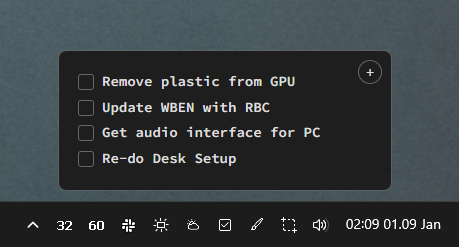

# Todoist Windows System Tray App

A minimal Windows system tray application for Todoist using Electron. Click the tray icon to see your latest todos and add new ones quickly.



## Development

```
# Install dependencies
npm install

# Run in development
npm start

# Build for distribution
npm run build              # Creates both installer and portable exe
npm run build-portable     # Creates only portable exe
npm run build-installer    # Creates only installer
```

## File Structure

```
minimal-todoist/
├── main.js              # Main Electron process
├── renderer/
│   ├── index.html       # Popup window UI
│   ├── styles.css       # Styling
│   └── renderer.js      # Frontend logic
├── assets/
│   └── tray-icon.png    # System tray icon
└── package.json
```

## License

MIT License - feel free to use and modify as needed.
