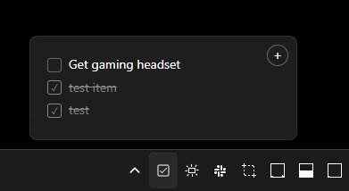

# Minimal Todoist - Windows System Tray App

A minimal Windows system tray application for Todoist using Electron. Click the tray icon to see your latest todos and add new ones quickly.



## Features

- System tray integration with click-to-show popup
- View latest todos and recently completed items (last 3 days)
- Add new todos directly from the popup
- Complete/uncomplete todos with a click
- Built-in settings dialog to configure your API key
- Clean, minimal interface with dark/light theme support
- Window positions automatically above tray icon

## Download & Installation

### Option 1: Portable Version (Recommended)
1. Download `Minimal Todoist.exe` from the [latest release](../../releases/latest)
2. Save it anywhere on your computer
3. Double-click to run - no installation required!

### Option 2: Installer Version
1. Download `Minimal Todoist Setup.exe` from the [latest release](../../releases/latest)
2. Run the installer to install the app
3. Find "Minimal Todoist" in your Start Menu or Programs

## First Time Setup

1. **Run the application** - It will appear in your system tray (notification area)

2. **Configure your API token:**
   - Right-click the tray icon and select "Settings"
   - Enter your Todoist API token
   - Get your token from [Todoist Integrations](https://todoist.com/prefs/integrations)
   - Click "Save"

3. **Start using the app:**
   - Click the tray icon to view your todos
   - Add new todos using the input field
   - Click checkboxes to complete/uncomplete todos
   - The app syncs automatically every 30 seconds

## Usage

- **View todos:** Click the tray icon to open the popup window
- **Add todos:** Type in the input field and press Enter or click the + button
- **Complete todos:** Click the checkbox next to any todo
- **Settings:** Right-click the tray icon and select "Settings"
- **Close popup:** Click outside the window or press Escape
- **Quit app:** Right-click the tray icon and select "Quit"

---

## Development

### Building from Source

1. **Install dependencies:**
   ```bash
   npm install
   ```

2. **Run in development:**
   ```bash
   npm start
   ```

3. **Build for distribution:**
   ```bash
   npm run build              # Creates both installer and portable exe
   npm run build-portable     # Creates only portable exe
   npm run build-installer    # Creates only installer
   ```

### Build Outputs
- `Minimal Todoist.exe` - Standalone portable executable
- `Minimal Todoist Setup.exe` - Windows installer package

## File Structure

```
minimal-todoist/
├── main.js              # Main Electron process
├── renderer/
│   ├── index.html       # Popup window UI
│   ├── styles.css       # Styling
│   └── renderer.js      # Frontend logic
├── assets/
│   └── tray-icon.png    # System tray icon
└── package.json
```